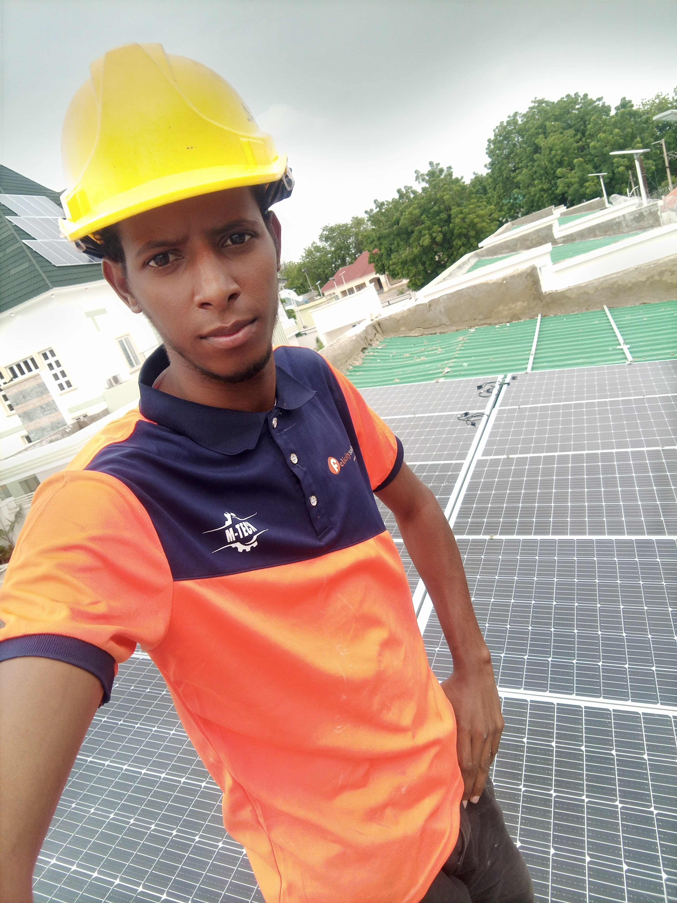

### Hi there 👋, my name is AL-AMIN
#### I am Electrical Engineer

I'm an Electrical Engineer skilled in solar system design and installation. I'm also proficient in Machine Learning, with expertise in Python, MATLAB, and ARDUINO. I completed the Applied Data Institute Equitech Futures program in 2022. Excited to collaborate on GitHub!

Skills: Python (Numpy, Pandas, Matplotlib, Sci-kit Learn, Tensorflow), MATLAB, Arduino

- 🔭 I’m currently working on Building Deep Learning based applications 
- 🌱 I’m currently learning Transformers 
- 👯 I’m looking to collaborate on Computer Vision, Sequence Modelling, Reinforcement Learning 
- 😄 Pronouns: He/Him 

        

